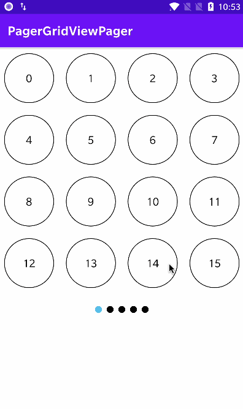
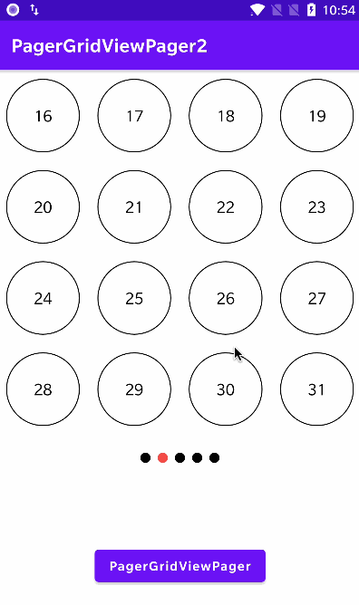

# PagerGridView

快速实现网格分页切换布局，类似聊天的表情切换面板。

|      PagerGridViewPager      |      PagerGridViewPager2      |
| :--------------------------: | :---------------------------: |
|  |  |

## 导入依赖

[](https://jitpack.io/#simplepeng/PagerGridView)

```groovy
allprojects {
	repositories {
		...
		maven { url 'https://jitpack.io' }
	}
}
```

```groovy
dependencies {
        implementation 'com.github.simplepeng:PagerGridView:v1.0.2'
}
```

## 使用

 继承`ItemAdapter`和`ItemViewHolder`，就像`RecyclerView`的使用方法

```kotlin
class InnerItemAdapter(
    private val mItems: List<String>
) : PagerGridView.ItemAdapter<InnerViewHolder>() {

    //列数
    override fun getSpanCount() = 4

    //行数
    override fun getLineCount() = 4

    override fun getItemCount() = mItems.size

    override fun onCreateViewHolder(
        parent: ViewGroup,
        viewType: Int
    ): InnerViewHolder {
        val itemView = LayoutInflater.from(parent.context)
            .inflate(R.layout.item_layout, parent, false)
        return InnerViewHolder(itemView)
    }

    override fun onBindViewHolder(
        holder: InnerViewHolder,
        adapterPosition: Int
    ) {
        //不要使用这个方法获取position，直接使用上面的`adapterPosition`
//        holder.adapterPosition

        holder.itemView.setOnClickListener {
            Toast.makeText(it.context, mItems[adapterPosition], Toast.LENGTH_SHORT)
                .show()
        }
        holder.tvItem.text = mItems[adapterPosition]
    }
}
```

```kotlin
class InnerViewHolder(itemView: View) : PagerGridView.ItemViewHolder(itemView) {

    val tvItem = itemView.findViewById<TextView>(R.id.tvItem)

}
```

```xml
<me.simple.pager.PagerGridViewPager2
    android:id="@+id/pagerGridViewPager2"
    android:layout_width="match_parent"
    android:layout_height="wrap_content"
    android:visibility="visible"
    app:layout_constraintTop_toTopOf="parent" />
或
<me.simple.pager.PagerGridViewPager
    android:id="@+id/pagerGridViewPager"
    android:layout_width="match_parent"
    android:layout_height="wrap_content"
    app:layout_constraintTop_toTopOf="parent" />
```

然后设置Adapter就行

```kotlin
pagerGridViewPager2.setAdapter(InnerItemAdapter(mItems))
```

## 指示器

推荐使用的开源库：

https://github.com/JakeWharton/ViewPagerIndicator

https://github.com/romandanylyk/PageIndicatorView

https://github.com/tommybuonomo/dotsindicator

## 版本迭代

* v1.0.1：完善Api调用
* v1.0.0：首次上传